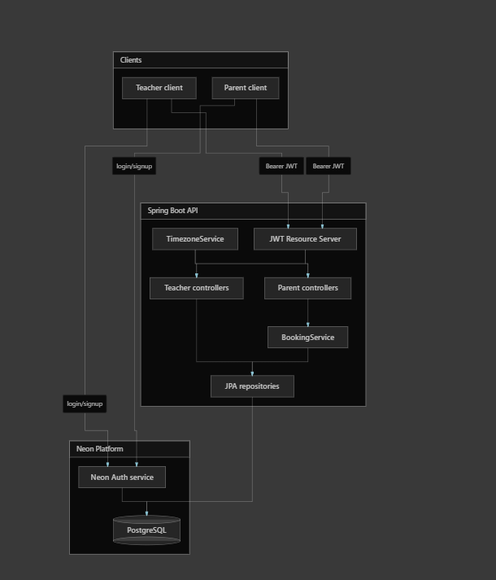
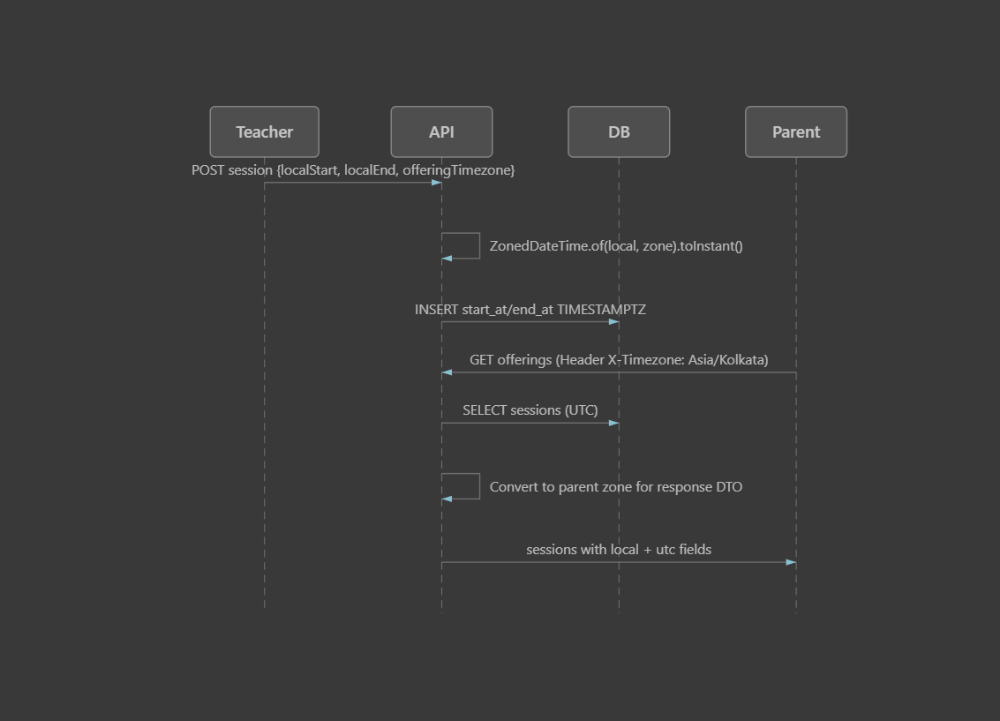
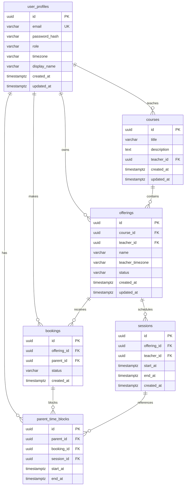

# Global Class Offering Booking System

Spring Boot backend for a global live-learning platform. Teachers create course offerings and schedule sessions in their local timezone; parents browse published offerings and book entire batches with conflict-safe scheduling across time zones.

---

## Table of Contents

1. [Overview](#overview)
2. [Architecture](#architecture)
3. [Timezone Handling](#timezone-handling)
4. [Tech Stack](#tech-stack)
5. [Project Setup & Startup](#project-setup--startup)
6. [Package & Class Structure](#package--class-structure)
7. [Database Schema Design](#database-schema-design)
8. [Authentication & Security](#authentication--security)
9. [API Reference](#api-reference)
10. [Booking Rules & Concurrency](#booking-rules--concurrency)
11. [Error Codes](#error-codes)
12. [Configuration](#configuration)
13. [Testing](#testing)

---

## Overview

| Actor | Capabilities |
|-------|-------------|
| **Teacher** | Create courses, create offerings, add sessions (local time), list own offerings |
| **Parent** | Browse published offerings, book an entire offering (all sessions), view own bookings |

Key design principles:

- All session times are stored as **UTC** (`TIMESTAMPTZ`) in PostgreSQL
- Teachers input **local** date/time in the offering's timezone
- Parents receive responses with both **UTC** and **localized** times via the `X-Timezone` header
- Booking conflicts are prevented at **application** and **database** levels

---

## Architecture



**Request flow:**

```
Teacher / Parent Client
        │
        ▼  Authorization: Bearer <JWT>
┌───────────────────────────────────────────────────┐
│              Spring Boot API (8080)               │
│  ┌─────────────────┐  ┌────────────────────────┐  │
│  │ JwtAuthFilter   │→ │ Controllers              │  │
│  │ + SecurityConfig│  │  AuthController          │  │
│  └─────────────────┘  │  TeacherController       │  │
│                         │  ParentController        │  │
│  ┌─────────────────┐  └───────────┬──────────────┘  │
│  │ AuthService     │              │                 │
│  │ OfferingService │              ▼                 │
│  │ BookingService  │  ┌────────────────────────┐    │
│  │ TimezoneService │  │ JPA Repositories       │    │
│  └─────────────────┘  └───────────┬────────────┘    │
└───────────────────────────────────│─────────────────┘
                                    ▼
                         ┌─────────────────────┐
                         │  Neon PostgreSQL    │
                         │  (Flyway migrations)│
                         └─────────────────────┘
```

> **Note:** Auth is handled by **Spring Security + self-issued JWT** (BCrypt passwords stored in `user_profiles`). Credentials are validated against PostgreSQL — not an external auth provider.

| Layer | Responsibility |
|-------|----------------|
| `controller` | HTTP routing, validation, role-based endpoints |
| `service` | Business logic, transactions, conflict checks |
| `repository` | Spring Data JPA data access |
| `mapper` | MapStruct entity ↔ DTO conversion (timezone-aware) |
| `security` | JWT generation, filter chain, user details |
| `exception` | Centralized error responses |

---

## Timezone Handling



### Teacher — create sessions

1. Teacher sends `localStart` / `localEnd` in the offering's `teacherTimezone`
2. `TimezoneService.toInstant()` converts local → UTC `Instant`
3. Stored in `sessions.start_at` / `sessions.end_at` as `TIMESTAMPTZ`

```json
{
  "sessions": [
    { "localStart": "2026-06-15T10:00:00", "localEnd": "2026-06-15T11:00:00" }
  ]
}
```

### Parent — view offerings / bookings

1. Parent sends `X-Timezone: Asia/Kolkata` (optional; falls back to profile timezone, then UTC)
2. Repository loads UTC timestamps from DB
3. `SessionResponseMapper` adds localized fields to the response DTO

**Response session fields:**

| Field | Description |
|-------|-------------|
| `startAtUtc` / `endAtUtc` | ISO-8601 UTC (canonical) |
| `startAtLocal` / `endAtLocal` | Converted to display zone |
| `displayTimezone` | Zone used for conversion |

---

## Tech Stack

| Component | Technology |
|-----------|-----------|
| Runtime | Java 21 |
| Framework | Spring Boot 3.4.5 |
| Security | Spring Security + JWT (jjwt 0.12) |
| Persistence | Spring Data JPA, Hibernate 6 |
| Database | PostgreSQL 17 (Neon) |
| Migrations | Flyway |
| DTO mapping | Lombok + MapStruct 1.6 |
| Validation | Jakarta Bean Validation |
| Monitoring | Spring Actuator |

---

## Project Setup & Startup

### Prerequisites

- Java 21+
- Maven 3.9+
- Neon PostgreSQL database (or local PostgreSQL with `btree_gist` extension)

### 1. Clone and configure

```powershell
cd booking-service
```

Copy environment template and set values:

```powershell
copy .env.example .env
```

| Variable | Description |
|----------|-------------|
| `SPRING_DATASOURCE_URL` | JDBC URL (`jdbc:postgresql://...?sslmode=require`) |
| `SPRING_DATASOURCE_USERNAME` | DB username |
| `SPRING_DATASOURCE_PASSWORD` | DB password |
| `JWT_SECRET` | HMAC secret (≥ 256 bits for production) |
| `JWT_EXPIRATION_MS` | Token lifetime in ms (default: 86400000 = 24h) |
| `PORT` | Server port (default: 8080) |

Defaults are in `src/main/resources/application.yml`. Override via environment variables for production.

### 2. Build

```powershell
mvn clean install -DskipTests
```

### 3. Run

```powershell
mvn spring-boot:run
```

Flyway applies migrations automatically on startup. Hibernate validates the schema (`ddl-auto: validate`).

### 4. Verify

```powershell
curl http://localhost:8080/actuator/health
# {"status":"UP"}
```

### 5. Typical workflow

```
Register Teacher → Register Parent → Login
    → Create Course → Create Offering (PUBLISHED)
    → Add Sessions → Parent lists offerings → Book offering
```

---

## Package & Class Structure

```
src/main/java/com/undoschool/booking/
│
├── BookingApplication.java          # Spring Boot entry point
│
├── config/
│   ├── SecurityConfig.java          # Filter chain, role rules, BCrypt, AuthManager
│   └── JwtProperties.java           # JWT secret & expiration (@ConfigurationProperties)
│
├── controller/
│   ├── AuthController.java          # POST /auth/register, /auth/login; GET /users/me/profile
│   ├── teacher/
│   │   └── TeacherController.java   # Course, offering, session CRUD (teacher role)
│   └── parent/
│       └── ParentController.java    # List offerings, book, list bookings (parent role)
│
├── domain/                          # JPA entities
│   ├── UserProfile.java             # email, passwordHash, role, timezone
│   ├── Course.java                  # title, description → teacher
│   ├── Offering.java                # name, teacherTimezone, status (DRAFT/PUBLISHED)
│   ├── ClassSession.java            # startAt, endAt (Instant/UTC) → offering
│   ├── Booking.java                 # parent + offering, status CONFIRMED/CANCELLED
│   ├── ParentTimeBlock.java         # Denormalized time blocks per booked session
│   ├── Role.java                    # TEACHER | PARENT
│   ├── OfferingStatus.java          # DRAFT | PUBLISHED
│   └── BookingStatus.java           # CONFIRMED | CANCELLED
│
├── dto/                             # Lombok request/response objects
│   ├── RegisterRequest.java
│   ├── LoginRequest.java
│   ├── AuthResponse.java
│   ├── ProfileResponse.java
│   ├── CreateCourseRequest.java
│   ├── CreateOfferingRequest.java
│   ├── AddSessionsRequest.java      # nested SessionTimeRequest (localStart/localEnd)
│   ├── OfferingResponse.java
│   ├── SessionResponse.java         # UTC + localized time fields
│   └── BookingResponse.java
│
├── mapper/                          # MapStruct (compile-time generated)
│   ├── UserProfileMapper.java
│   ├── SessionResponseMapper.java   # UTC ↔ local conversion via TimezoneService
│   ├── OfferingResponseMapper.java
│   └── BookingResponseMapper.java
│
├── repository/                      # Spring Data JPA
│   ├── UserProfileRepository.java   # findByEmail, findByIdForUpdate (PESSIMISTIC_WRITE)
│   ├── CourseRepository.java
│   ├── OfferingRepository.java      # findByTeacherWithSessions, findPublishedWithSessions
│   ├── ClassSessionRepository.java
│   ├── BookingRepository.java
│   └── ParentTimeBlockRepository.java  # hasOverlapWithOffering (native SQL)
│
├── security/
│   ├── JwtService.java              # Token generation & validation (HS512)
│   ├── JwtAuthenticationFilter.java # Once-per-request Bearer token filter
│   ├── CustomUserDetailsService.java
│   ├── SecurityUser.java            # UserDetails wrapper around UserProfile
│   └── CurrentUserProvider.java     # Resolves authenticated user from SecurityContext
│
├── service/
│   ├── AuthService.java             # Register, login, profile
│   ├── UserProfileService.java      # Profile lookup with role check
│   ├── OfferingService.java         # Courses, offerings, sessions
│   ├── BookingService.java          # Book offering, conflict detection, time blocks
│   └── TimezoneService.java         # Zone parsing, instant formatting
│
└── exception/
    ├── AppException.java            # Domain exception with ErrorCode
    ├── ErrorCode.java               # VALIDATION_ERROR, TIME_CONFLICT, etc.
    ├── ErrorResponse.java           # JSON error body
    └── GlobalExceptionHandler.java  # @RestControllerAdvice — maps exceptions → HTTP
```

### Layer responsibilities

| Class | Role |
|-------|------|
| `AuthService` | BCrypt hashing, JWT issuance on register/login |
| `OfferingService` | Validates teacher ownership; converts local session times to UTC |
| `BookingService` | Pessimistic lock on parent row; overlap check; creates `ParentTimeBlock` rows |
| `TimezoneService` | Resolves `X-Timezone` header → `ZoneId`; formats instants for DTOs |
| `GlobalExceptionHandler` | Maps `AppException`, validation errors, DB constraint violations to HTTP status |

---

## Database Schema Design

### Entity-Relationship Diagram



### Tables

#### `user_profiles`

| Column | Type | Notes |
|--------|------|-------|
| `id` | UUID PK | Auto-generated |
| `email` | VARCHAR UNIQUE NOT NULL | Login identifier (lowercased) |
| `password_hash` | VARCHAR NOT NULL | BCrypt hash |
| `role` | VARCHAR CHECK | `TEACHER` or `PARENT` |
| `timezone` | VARCHAR NOT NULL | IANA zone (e.g. `America/New_York`) |
| `display_name` | VARCHAR NOT NULL | |
| `created_at` / `updated_at` | TIMESTAMPTZ | Auto-managed |

#### `courses`

| Column | Type | Notes |
|--------|------|-------|
| `id` | UUID PK | |
| `title` | VARCHAR NOT NULL | |
| `description` | TEXT | Optional |
| `teacher_id` | UUID FK → `user_profiles` | Must be TEACHER role |

#### `offerings`

| Column | Type | Notes |
|--------|------|-------|
| `id` | UUID PK | |
| `course_id` | UUID FK → `courses` | |
| `teacher_id` | UUID FK → `user_profiles` | |
| `name` | VARCHAR NOT NULL | Batch name |
| `teacher_timezone` | VARCHAR NOT NULL | Zone for session input |
| `status` | VARCHAR CHECK | `DRAFT` (default) or `PUBLISHED` |

#### `sessions`

| Column | Type | Notes |
|--------|------|-------|
| `id` | UUID PK | |
| `offering_id` | UUID FK → `offerings` ON DELETE CASCADE | |
| `teacher_id` | UUID FK → `user_profiles` | |
| `start_at` / `end_at` | TIMESTAMPTZ NOT NULL | Stored in UTC; `end_at > start_at` |

#### `bookings`

| Column | Type | Notes |
|--------|------|-------|
| `id` | UUID PK | |
| `offering_id` | UUID FK → `offerings` | |
| `parent_id` | UUID FK → `user_profiles` | Must be PARENT role |
| `status` | VARCHAR CHECK | `CONFIRMED` or `CANCELLED` |

#### `parent_time_blocks`

Denormalized copy of each booked session's time range per parent. Enables fast overlap detection and DB-level exclusion constraints.

| Column | Type | Notes |
|--------|------|-------|
| `id` | UUID PK | |
| `parent_id` | UUID FK | |
| `booking_id` | UUID FK ON DELETE CASCADE | |
| `session_id` | UUID FK → `sessions` | |
| `start_at` / `end_at` | TIMESTAMPTZ NOT NULL | Copy of session times |

### Indexes & Constraints

| Name | Type | Purpose |
|------|------|---------|
| `idx_*` | B-tree indexes | FK lookups on teacher, parent, offering, status |
| `uq_bookings_parent_offering_confirmed` | Partial unique index | One confirmed booking per parent per offering |
| `no_parent_time_overlap` | **EXCLUDE (gist)** | Prevents overlapping `[start_at, end_at)` ranges for the same `parent_id` |
| `sessions_end_after_start` | CHECK | `end_at > start_at` |
| `btree_gist` extension | PostgreSQL | Required for exclusion constraint |

**Flyway migrations:**

| Version | File | Content |
|---------|------|---------|
| V1 | `V1__extensions_and_schema.sql` | Extension + all tables |
| V2 | `V2__indexes_and_constraints.sql` | Indexes, partial unique, EXCLUDE constraint |
| V3 | `V3__spring_security_auth.sql` | Replace `auth_user_id` with `email` + `password_hash` |

---

## Authentication & Security

### Register

```http
POST /api/v1/auth/register
Content-Type: application/json

{
  "email": "teacher@example.com",
  "password": "password123",
  "role": "TEACHER",
  "timezone": "America/New_York",
  "displayName": "Jane Teacher"
}
```

Returns `201` with `{ accessToken, tokenType: "Bearer", profile }`.

Roles: `TEACHER` | `PARENT`

### Login

```http
POST /api/v1/auth/login
Content-Type: application/json

{ "email": "teacher@example.com", "password": "password123" }
```

### Protected routes

```
Authorization: Bearer <accessToken>
```

### Route access matrix

| Path | TEACHER | PARENT | Anonymous |
|------|---------|--------|-----------|
| `/actuator/health` | ✅ | ✅ | ✅ |
| `/api/v1/auth/**` | ✅ | ✅ | ✅ |
| `/api/v1/users/me/profile` | ✅ | ✅ | ❌ 403 |
| `/api/v1/teachers/**` | ✅ | ❌ 403 | ❌ 403 |
| `GET/POST /api/v1/offerings/**` | ❌ 403 | ✅ | ❌ 403 |
| `/api/v1/parents/**` | ❌ 403 | ✅ | ❌ 403 |

---

## API Reference

### Teacher APIs

| Method | Path | Status | Description |
|--------|------|--------|-------------|
| POST | `/api/v1/teachers/courses` | 201 | Create course |
| POST | `/api/v1/teachers/offerings` | 201 | Create offering |
| POST | `/api/v1/teachers/offerings/{id}/sessions` | 200 | Add sessions |
| GET | `/api/v1/teachers/offerings?upcoming=true` | 200 | List own offerings |

**Create offering** (must be `PUBLISHED` for parents to see/book):

```json
{
  "courseId": "uuid",
  "name": "Saturday Batch",
  "teacherTimezone": "America/New_York",
  "status": "PUBLISHED"
}
```

**Add sessions** (local times in offering timezone):

```json
{
  "sessions": [
    { "localStart": "2026-06-06T18:00:00", "localEnd": "2026-06-06T19:00:00" }
  ]
}
```

### Parent APIs

| Method | Path | Status | Description |
|--------|------|--------|-------------|
| GET | `/api/v1/offerings?upcoming=true` | 200 | List published offerings |
| POST | `/api/v1/offerings/{id}/bookings` | 201 | Book entire offering |
| GET | `/api/v1/parents/me/bookings?upcoming=true` | 200 | List my bookings |

Optional header on read endpoints: `X-Timezone: Asia/Kolkata`

### Profile

```http
GET /api/v1/users/me/profile
Authorization: Bearer <token>
```

---

## Booking Rules & Concurrency

### Business rules

1. Parents book the **entire offering** (all sessions at once)
2. Only `PUBLISHED` offerings with at least one session are bookable
3. A parent cannot book the same offering twice (`ALREADY_BOOKED`)
4. A parent cannot book offerings whose sessions overlap existing bookings (`TIME_CONFLICT`)

### Conflict detection (three layers)

```
Layer 1 — Application (BookingService)
  ├── PESSIMISTIC_WRITE lock on parent row (findByIdForUpdate)
  └── hasOverlapWithOffering() SQL check before insert

Layer 2 — Partial unique index
  └── uq_bookings_parent_offering_confirmed (parent_id, offering_id) WHERE status = 'CONFIRMED'

Layer 3 — PostgreSQL EXCLUDE constraint
  └── no_parent_time_overlap: same parent_id cannot have overlapping tstzrange blocks
```

This handles concurrent booking requests: even if two threads pass the application check simultaneously, the database constraint rejects the loser with `409 TIME_CONFLICT`.

### Conflict examples

| Scenario | HTTP | Error |
|----------|------|-------|
| Book same offering twice | 409 | `ALREADY_BOOKED` |
| Book overlapping offering (e.g. 10:30–11:30 vs existing 10:00–11:00) | 409 | `TIME_CONFLICT` |
| Book DRAFT offering | 422 | `OFFERING_NOT_BOOKABLE` |

---

## Error Codes

| HTTP | ErrorCode | When |
|------|-----------|------|
| 400 | `VALIDATION_ERROR` | Invalid input, duplicate email |
| 401 | `UNAUTHORIZED` | Bad credentials |
| 403 | `FORBIDDEN` | Wrong role or missing token |
| 404 | `NOT_FOUND` | Resource not found |
| 409 | `ALREADY_BOOKED` | Duplicate booking |
| 409 | `TIME_CONFLICT` | Overlapping session times |
| 422 | `OFFERING_NOT_BOOKABLE` | Draft or no sessions |
| 500 | `INTERNAL_ERROR` | Unexpected server error |

Error response shape:

```json
{
  "error": "TIME_CONFLICT",
  "message": "Booking overlaps with an existing session",
  "timestamp": "2026-05-30T10:00:00Z"
}
```

---

## Configuration

| Property / Env Var | Default | Description |
|--------------------|---------|-------------|
| `app.jwt.secret` / `JWT_SECRET` | (see application.yml) | HMAC signing key |
| `app.jwt.expiration-ms` / `JWT_EXPIRATION_MS` | 86400000 | Token TTL (24h) |
| `server.port` / `PORT` | 8080 | HTTP port |
| `spring.datasource.url` | Neon JDBC URL | PostgreSQL connection |
| `spring.jpa.hibernate.ddl-auto` | validate | Schema managed by Flyway only |

---

## Testing

### Automated API test script

Run all 21 endpoint checks (auth, CRUD, conflicts, timezone):

```powershell
powershell -ExecutionPolicy Bypass -File test-api.ps1
```

Uses `curl.exe` with JSON files (Windows-safe). Expects server on `http://localhost:8080`.

### Postman

Import a Postman collection and run folders in order:

1. Health check
2. Register / login (teacher + parent)
3. Create course + published offering
4. Add sessions
5. View offerings
6. Book offering
7. Conflict detection (409 cases)
8. Timezone conversion (`X-Timezone` header comparison)

### Manual curl (Windows)

Use a JSON file to avoid escaping issues:

```powershell
@'
{"email":"teacher@test.com","password":"password123","role":"TEACHER","displayName":"Test","timezone":"America/New_York"}
'@ | Set-Content register.json -Encoding utf8NoBOM

curl.exe -X POST http://localhost:8080/api/v1/auth/register `
  -H "Content-Type: application/json" --data-binary "@register.json"
```

---

## Resources

| Resource | Location |
|----------|----------|
| Architecture diagram | [`img/architecture.png`](img/architecture.png) |
| Timezone flow diagram | [`img/timezone-flow.png`](img/timezone-flow.png) |
| Flyway migrations | `src/main/resources/db/migration/` |
| Environment template | `.env.example` |
| API test script | `test-api.ps1` |
